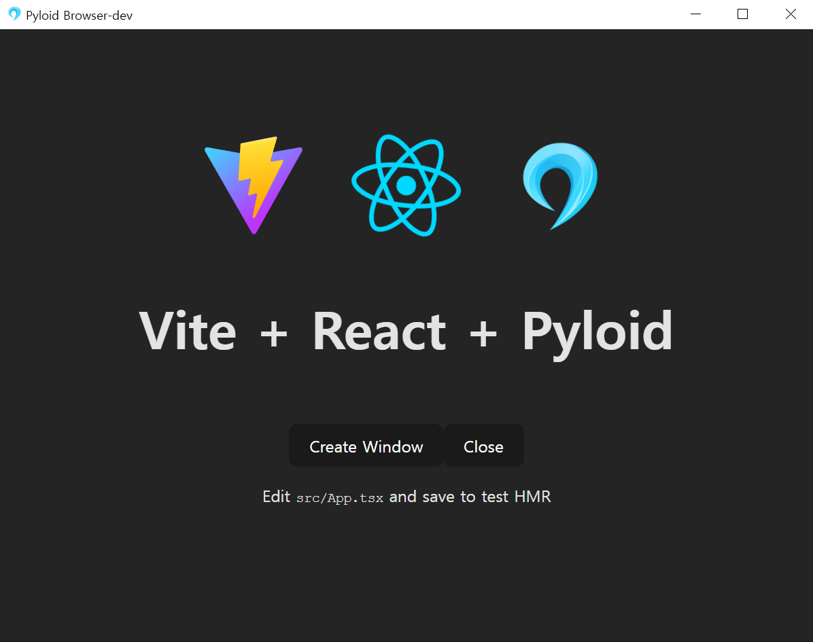

# 💎 What is Pyloid?

## Pyloid 👋

Pyloid is the Python backend version of Electron and Tauri, designed to simplify desktop application development. This open-source project, built on **QtWebEngine** and **PySide6**, provides seamless integration with various Python features



### 🚀 Why Pyloid?

With Pyloid, you can leverage the full power of Python in your desktop applications. Its simplicity and flexibility make it the perfect choice for both beginners and experienced developers looking for a Python-focused alternative to Electron or Tauri. It is especially optimized for building AI-powered desktop applications.

### Key Features

- **Web-based GUI Generation**
- **System Tray Icon Support**
- **Multi-Window Management**
- **Bridge API between Python and JavaScript**
- **Single Instance Application / Multi Instance Application Support**
- **Comprehensive Desktop App Features**
- **Clean and Intuitive Code Structure**
- **Live UI Development Experience**
- **Cross-Platform Support**
- **Integration with Various Frontend Libraries**
- **Window Customization**
- **Detailed Numpy-style Docstrings**

### Quick Start



```bash
npm create pyloid-app@latest
```



```bash
pnpm create pyloid-app@latest
```



```bash
yarn create pyloid-app@latest
```



```bash
bun create pyloid-app@latest
```



<table data-view="cards"><thead><tr><th></th><th></th><th data-hidden data-card-cover data-type="files"></th><th data-hidden></th><th data-hidden data-card-target data-type="content-ref"></th></tr></thead><tbody><tr><td><strong>Getting Started</strong></td><td>Start Pyloid Project</td><td></td><td></td><td><a href="getting-started/prerequisites.md">prerequisites.md</a></td></tr><tr><td>References</td><td>Python/Js API Reference</td><td></td><td></td><td><a href="api/python-backend/">python-backend</a></td></tr><tr><td><strong>Guides</strong></td><td>Pyloid Guide</td><td></td><td></td><td><a href="guides/build-guide/">build-guide</a></td></tr></tbody></table>
