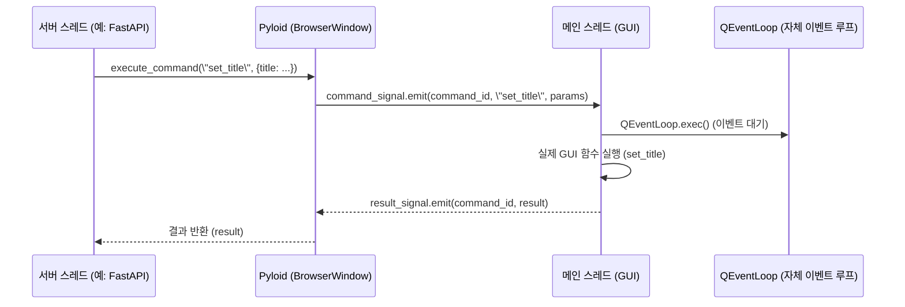

# 스레드 세이프(Thread Safety)

Pyloid는 PySide6 기반의 GUI 애플리케이션에서 **QEventLoop**와 **자체 이벤트 루프**를 활용하여, 메인 스레드에서만 동작해야 하는 GUI 함수들을 **비동기적**으로, 그리고 **스레드 세이프**하게 다른 스레드에서도 안전하게 호출할 수 있도록 설계되었습니다.

이 구조를 통해 Python의 다양한 서버 프레임워크(예: FastAPI, Flask, Django 등)와의 자연스러운 연동이 가능하며, 서버에서 발생한 이벤트나 명령을 GUI에 실시간으로 반영할 수 있습니다.

```text
서버 스레드
    |
    | execute_command()
    v
Pyloid (BrowserWindow)
    |
    | command_signal.emit()
    v
메인 스레드 (GUI)
    |
    | QEventLoop.exec()
    v
실제 GUI 함수 실행
    |
    | result_signal.emit()
    v
Pyloid (BrowserWindow)
    |
    | 결과 반환
    v
서버 스레드
```




Pyloid의 핵심 원리는 다음과 같습니다.

- **명령 신호(command_signal)와 결과 신호(result_signal)를 활용한 스레드 간 통신**  
  별도의 스레드에서 GUI 관련 함수를 호출하면, 해당 명령이 신호로 메인 스레드에 전달되고, 메인 스레드에서는 자체 **QEventLoop**를 통해 이벤트를 처리합니다. GUI 함수 실행이 끝나면 결과가 다시 신호로 반환되어, 호출한 스레드는 결과를 안전하게 받을 수 있습니다.

- **비동기적 명령 처리와 자체 이벤트 루프**  
  Pyloid는 각 명령 실행 시 자체적으로 **QEventLoop**를 생성하여, 비동기적으로 명령의 완료를 기다립니다. 이를 통해 서버 스레드와 GUI 스레드가 서로 블로킹 없이 통신할 수 있으며, GUI의 응답성을 유지할 수 있습니다.

- **서버-클라이언트 구조와의 강력한 호환성**  
  이 구조 덕분에, 서버 스레드에서 직접 윈도우를 띄우거나, 웹 요청에 따라 GUI를 동적으로 제어하는 등 다양한 시나리오가 안전하게 구현 가능합니다. 예를 들어, FastAPI 서버에서 HTTP 요청을 받아 Pyloid 윈도우의 내용을 실시간으로 변경하거나, Flask에서 발생한 이벤트를 GUI에 즉시 반영하는 것이 가능합니다.